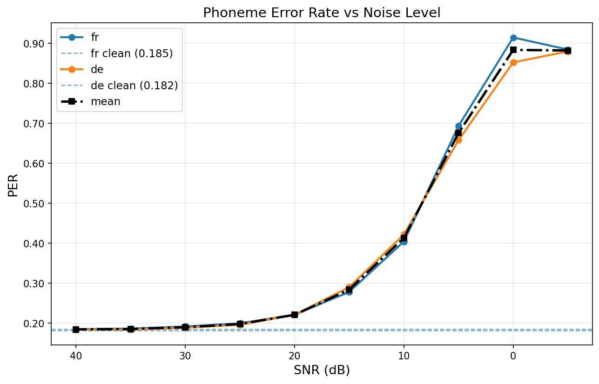

# How robust is phoneme recognition to noise?

A reproducible DVC pipeline that measures how a multilingual phoneme recognition model (wav2vec2) degrades as Gaussian noise is added to speech, in French and German.

## Question

At what noise level does phoneme recognition stop being usable, and do two languages degrade the same way?

## Setup

| | |
|---|---|
| Model | `facebook/wav2vec2-lv-60-espeak-cv-ft` (outputs IPA phonemes) |
| Data | [Multilingual LibriSpeech](https://huggingface.co/datasets/facebook/multilingual_librispeech), test split, 200 utterances per language |
| Languages | French, German |
| Conditions | Clean audio + Gaussian noise at 10 SNR levels (−5 to 40 dB) |
| Reference | eSpeak-ng phonemization of the transcripts |
| Metric | Phoneme Error Rate (PER), edit distance between reference and predicted phonemes |

## Pipeline

```
download → phonemize → add_noise → inference → evaluate
```

Each stage is defined in `dvc.yaml` and repeated for every language listed in `params.yaml`. All settings (languages, number of utterances, SNR levels, model) live in `params.yaml`, so adding a language only means adding it to the list. DVC reruns only the stages whose inputs changed.

```bash
pip install -r requirements.txt
python -m dvc dag      # show the pipeline graph
python -m dvc repro    # run everything
```

Phonemization needs `espeak-ng` on the system (`apt-get install espeak-ng`). Inference was run on an NVIDIA A2 GPU (about 14 minutes per language for 2,200 files).

## Results



| SNR (dB) | Clean | 40 | 30 | 25 | 20 | 15 | 10 | 5 | 0 | −5 |
|---|---|---|---|---|---|---|---|---|---|---|
| PER (fr) | 0.185 | 0.185 | 0.192 | 0.200 | 0.221 | 0.278 | 0.404 | 0.694 | 0.915 | 0.885 |
| PER (de) | 0.182 | 0.184 | 0.188 | 0.196 | 0.221 | 0.291 | 0.422 | 0.658 | 0.853 | 0.880 |

- PER stays close to the clean baseline (about 0.18) down to 25 dB.
- It starts rising at 20 dB and passes 0.40 at 10 dB.
- The practical robustness threshold is around **15 dB**.
- French and German follow almost the same curve, so the degradation depends on the noise level more than on the language.

## A measurement problem worth knowing about

The first PER values were too high, even on clean audio. The cause was not the model but the comparison: eSpeak references contain stress marks (ˈ ˌ) and length marks (ː), which the model never outputs. Every one of them counted as an error.

Both sequences are now normalized with `unicodedata` to remove these marks before computing the edit distance. Without this step, the reported PER mostly measured a formatting difference.

## Limitations

- 200 utterances per language, from a single dataset of read audiobook speech.
- Synthetic white Gaussian noise, which is easier to control but less realistic than real background noise (traffic, voices, music).
- Because stress and length marks are removed, PER measures segmental errors only.
- The slight drop in PER at −5 dB is an artefact: at extreme noise the model produces very short outputs, which changes how the edit distance behaves.
